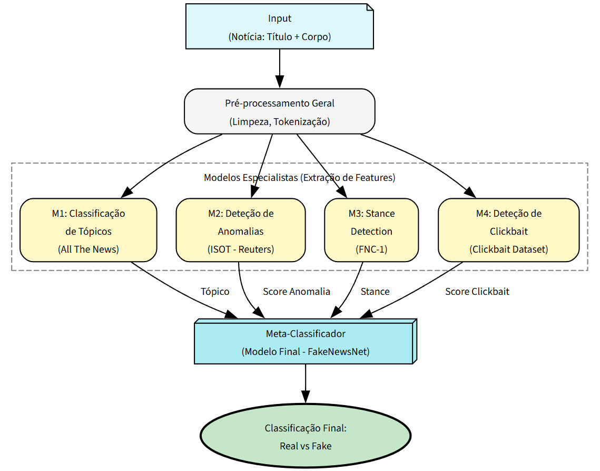
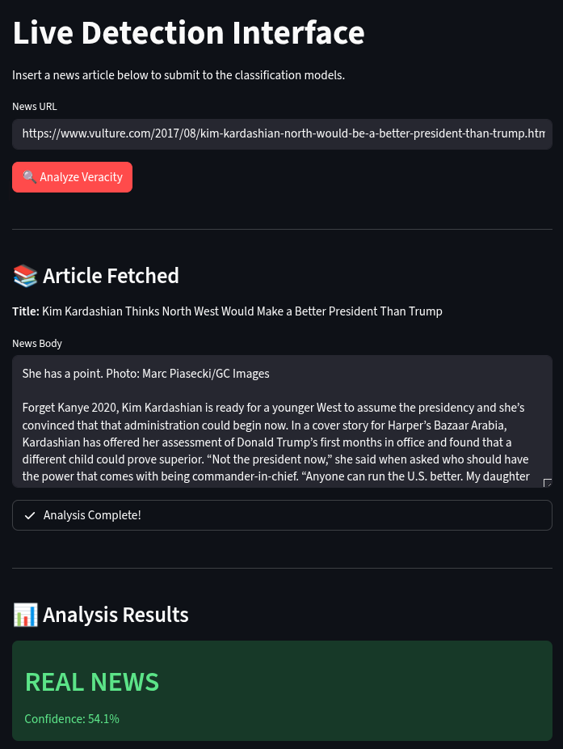
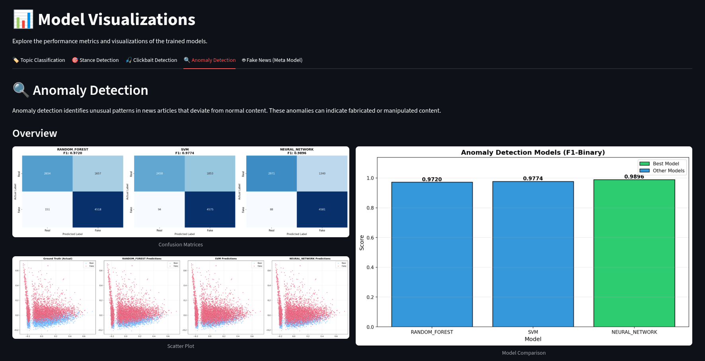

<h1 align="center">Practical Work on Machine Learning</h1>

  
  
  

---

## Fake News Detection System: Multi-Model Approach

A robust Machine Learning system designed to classify the veracity of news articles. Instead of a monolithic approach, this project uses a **Stacking Ensemble (Hierarchical Architecture)** that breaks down the problem into specialized sub-tasks (Topic, Anomaly, Stance, and Clickbait detection) before making a final decision.

Developed for the Master's in Informatics Engineering.

### 👨‍💻 Authors
* Diogo Pereira
* Hugo Guimarães

---

## High-Level Architecture

The system processes news articles through two main levels:

1. **Level 1 (Specialist Models):** Extracts distinct features from the text.
   * **M1: Topic Classification:** NMF (Non-Negative Matrix Factorization).
   * **M2: Anomaly Detection:** Neural Network.
   * **M3: Stance Detection:** SVM (Support Vector Machine).
   * **M4: Clickbait Detection:** CNN (Convolutional Neural Network).
2. **Level 2 (Meta-Classifier):** An **XGBoost** model that aggregates the predictions from the specialists to output the final verdict (Real vs. Fake).

  

---

## Tech Stack

* **Language:** Python
* **Machine Learning / NLP:** Scikit-Learn, TensorFlow/Keras, XGBoost, NLTK
* **Web Interface:** Streamlit

---

## Web Interface (Streamlit)

A user-friendly web interface was built to interact with the trained models in real-time, featuring automatic web scraping for URL inputs and a dedicated dashboard for model performance metrics.

### Live Detection

  

### Model Visualizations & Metrics

  

